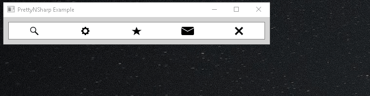
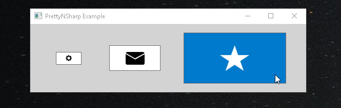

# PrettyNSharp


[](https://www.gnu.org/licenses/old-licenses/gpl-3.0.en.html)


Create beautiful and scalable custom UI controls for your c#/WPF application. **It's quick, easy, pretty, and always sharp!**

|  |
|:--:| 
| *[PrettyNSharp] Scalable Desgin: no more blurry controls!* |

## How to get started
### To run the demo code with the PrettyNSharp solution
* Open the [PrettyNSharp solution](PrettyNSharp.sln) with VisualStudio
* Run 

### To use PrettyNSharp in your own solution
* Add the PrettyNSharp project file [PrettyNSharp.csproj](prettynsharp/PrettyNSharp.csproj) to your solution (c.f. [Add existing project to solution](https://docs.microsoft.com/en-us/sql/ssms/solution/add-an-existing-project-to-a-solution?view=sql-server-2017))
* Add reference to PrettyNSharp to the project(s) in your solution which will use PrettyNSharp (c.f [Add project reference](https://msdn.microsoft.com/en-us/library/hh708954.aspx))
* (Optional) If you want to use my SVG designs, add a reference to the PrettyNSharp [SVG Dictionary](prettynsharp/SVGLibrary.xaml) in your App.xaml. (c.f. [Use SVG defined in PrettyNSharp](https://github.com/MarkoPaul0/PrettyNSharp/wiki/Use-SVG-designs-defined-in-PrettyNSharp))
* You're ready to rock :thumbsup:

## Examples:
### Create a PrettyNSharp button, aka. SharpButton

```xaml
<pns:SharpButton Height="25"  Width="50"  Vector="{StaticResource Gear}" VectorHeight="50%"/>
<pns:SharpButton Height="50"  Width="100" Vector="{StaticResource Mail}" VectorHeight="50%"/>
<pns:SharpButton Height="100" Width="200" Vector="{StaticResource Star}" VectorHeight="50%"/>
```
This gives you the following:

|  |
|:--:| 
| *[PrettyNSharp] That's how you star a repo by the way ;)* |


