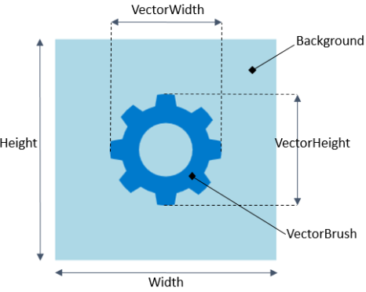
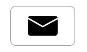
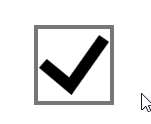
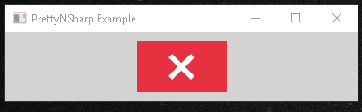
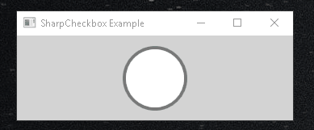
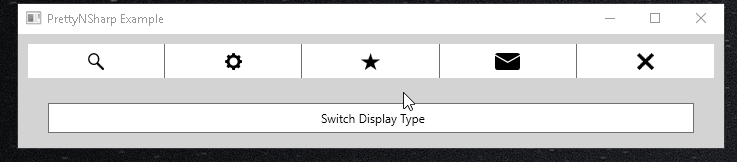

# PrettyNSharp


[](https://www.gnu.org/licenses/old-licenses/gpl-3.0.en.html)


Leverage the power of vector-graphics to create beautiful and scalable custom UI controls for your c#/WPF application. **It's quick, easy, pretty, and always sharp!**

|  |
|:--:| 
| *[PrettyNSharp] Scalable Desgin: no more blurry controls!* |


## How to get started
### To run the demo code with the PrettyNSharp solution
* Open the [PrettyNSharp solution](PrettyNSharp.sln) with VisualStudio
* Run

### To use PrettyNSharp in your own solution
* Add the [PrettyNSharp project](prettynsharp/PrettyNSharp.csproj) to your solution (c.f. [Add existing project to solution](https://docs.microsoft.com/en-us/sql/ssms/solution/add-an-existing-project-to-a-solution?view=sql-server-2017))
* Add a PrettyNSharp reference to every project in your solution using it (c.f [Add project reference](https://msdn.microsoft.com/en-us/library/hh708954.aspx))
* (Optional) If you want to use my SVG designs, add a reference to the PrettyNSharp [SVG Dictionary](prettynsharp/SVGLibrary.xaml) in your App.xaml (c.f. [Use SVG defined in PrettyNSharp](https://github.com/MarkoPaul0/PrettyNSharp/wiki/Use-SVG-designs-defined-in-PrettyNSharp))
* Add the following PrettyNSharp xmlns mapping `xmlns:pns="clr-namespace:PrettyNSharp;assembly=PrettyNSharp"` in all XAML files using PrettyNSharp controls (c.f. [Mapping to custom assemblies](https://docs.microsoft.com/en-us/dotnet/framework/wpf/advanced/xaml-namespaces-and-namespace-mapping-for-wpf-xaml#mapping-to-custom-classes-and-assemblies))
* You're ready to rock :thumbsup: If you have issues, look at the [ExampleWPFApp](/examples/ExampleWPFApp)

## Usage
The PrettyNSharp library contains 3 types of controls: the **SharpDisplay**, the **SharpButton**, and the **SharpCheckbox**.



<br>

## The SharpDisplay 

The SharpDisplay is a WPF user control which allows you to display SVG data without headache. It does so by exposing the following dependency properties:
* **Vector**: set the SVG graphic design you want to display
* **VectorWidth** and **VectorHeight**: set the width and heigh of the SVG design (which can be a number, Auto, a percentage, or \*, [more on that here](#more_on_size))
* **VectorBrush**: fill color of the Vector

The SharpDisplay showcased on the right was produced using the following xaml code:
```xaml
<pns:SharpDisplay  Width="250" Height="250" Background="LightBlue" BorderThickness="1"
                   VectorBrush="#007ACC" Vector="{StaticResource Gear}" VectorHeight="50%"/>
```

## The SharpButton



The SharpButton is a user control deriving from the standard [C#/WPF Button class](https://msdn.microsoft.com/en-us/library/system.windows.controls.button(v=vs.110).aspx). It inherits all of its properties and features with a few added bonuses:
* **HighlightBrush**: fill color of the Vector when the mouse is over
* **BackgroundOnHover** and **BackgroundOnClick**: background color on hover and on click, respectively
* **CornerRadius**: corner radius of your button

## The SharpCheckbox



The SharpCheckbox is a user control deriving from the standard [C#/WPF Checkbox class](https://msdn.microsoft.com/en-us/library/system.windows.controls.checkbox(v=vs.110).aspx). It inherits all of its properties and features with - *you guessed it* - a few added bonuses:
* **CheckMark** and **NullMark**: set the SVG graphic designs used as checkbox mark when the IsSet property is true and null, repectively
* **MarkBrush** and **MarkHighligh**: set the fill color for the mark in normal conditions and when the mouse is over, respectively
* **BorderOnHover**: set the border color when the mouse is over
* **CornerRadius**: set the border corner radius


## Customize your PrettyNSharp UI controls

PrettyNSharp controls are customizable just like any other WPF control. Here I will showcase a few things you could do to make your PrettyNSharp controls even prettier!

### Example of customized close SharpButton



Let's say you want your close button to look like this. In that case I would start by telling you that you are a person with great taste. The cool thing is, your great taste can become reality with with PrettyNSharp.
The xaml achieving this *level of prettiness* is as follows:

```xaml
<pns:SharpButton Width="100" BorderThickness="0"
                 Vector="{StaticResource Cross}" VectorHeight="50%" VectorBrush="White" 
                 Background="#E83140" BackgroundOnHover="#E87E87" BackgroundOnClick="#E83140"/>
```

Of course you can also define a style matching the results shown above, allowing you to reuse your close button design very quickly. Your xaml could become as simple as:

```xaml
<pns:SharpButton style={StaticResource CloseButtonStyle}/>
```

### Example of customized SharpCheckbox



Let's say you want your checkboxes to look like this. I actually do not recommand that design because it resembles a radio buttion, especially when unchecked. This example is here to show possibilities by doing something quite *different*.

<br>

In any case, the xaml achieving this *never-seen-before level of beauty* is as follows:

```xaml
<pns:SharpCheckbox BorderThickness="4" Height="50" CornerRadius="25" MarkMargin="5"/>
```

### A neat feature of SharpButton: ContentDisplay types

Since a picture is worth a 1000 words, let's check that one out.

|  |
|:--:| 
| *[PrettyNSharp] ContentDisplay Type in SharpButton* |

This was actually a gif, and since it contains 52 frames, I guess it's worth 52,000 words. *How about that..*<br>
As you can see, buttons can be switched between 3 types of "Content Display":
* **IconOnly**: this is the default value, only the SVG is displayed
* **Both**: both the SVG and the content are diplayed
* **ContentOnly**: only the content is displayed

This is very cool - *I decided so* - if you have an app with a lot of menus and buttons. Once you are familiar with that app you might be ok with Icons only, but for a while you might want to have a look at what things mean without having to wait for the tooltip to show up.

This unparalleled *level of refinement* was achieved with the following xaml:

```xaml
<Grid >
    <Grid.ColumnDefinitions>
        <ColumnDefinition Width="*"/>
        <ColumnDefinition Width="*"/>
        <ColumnDefinition Width="*"/>
        <ColumnDefinition Width="*"/>
        <ColumnDefinition Width="*"/>
    </Grid.ColumnDefinitions>
    <pns:SharpButton Grid.Column="0" BorderThickness="0,0,1,0"
                     Content="Search" Vector="{StaticResource Magnifier}" 
                     VectorHeight="50%" ContentDisplay="{Binding DisplayType}"/>
    <pns:SharpButton Grid.Column="1" BorderThickness="0,0,1,0"
                     Content="Settings" Vector="{StaticResource Gear}" 
                     VectorHeight="50%" ContentDisplay="{Binding DisplayType}"/>
    <pns:SharpButton Grid.Column="2" BorderThickness="0,0,1,0" 
                     Content="Starred!" Vector="{StaticResource Star}" 
                     VectorHeight="50%" ContentDisplay="{Binding DisplayType}"/>
    <pns:SharpButton Grid.Column="3" BorderThickness="0,0,1,0"
                     Content="Messages" Vector="{StaticResource Mail}" 
                     VectorHeight="50%" ContentDisplay="{Binding DisplayType}"/>
    <pns:SharpButton Grid.Column="4" BorderThickness="0"
                     Vector="{StaticResource Cross}" VectorHeight="50%" 
                     BackgroundOnHover="#E83140" BackgroundOnClick="#E87E87" 
                     Content="Close" ContentDisplay="{Binding DisplayType}"/>
 </Grid>
```

<a name="more_on_size"/>

## More about VectorHeight and VectorWidth
As seen before, you can control the size of the vector by setting its height and width. Both properties are of type **AdvanceLength**, which allows you to fine tune how you want the vector to be displayed. AdancedLength allows for 3 types of values:
* **Auto**: this is the default value. The vector will take as much space as available while maitaining its proportions
* **\***: if set to \*, the vector will take as much space as possible in the corresponding direction
* **\<percentage>**: if set to 10%, the vector will take 10% of its container in that direction
* **\<double>**: if set to an absolute value, the vector take that absolute size in that direction

**A cool thing to note is that as long as one dimension is set to Auto, then the vector will maintain its proportions.** So for example you can say "*I want the vector to take 50% of the width of the SharpButton, while keeping its proportions intact*". To do so you simply set `VectorWidth="50%"`. (Since Auto is the default value, you don't have to explicitely set `VectorHeight=Auto`)

### A neat feature of the SharpCheckbox: "toggle mode"
(coming soon)

## Create your own SVG designs
(comming soon)


